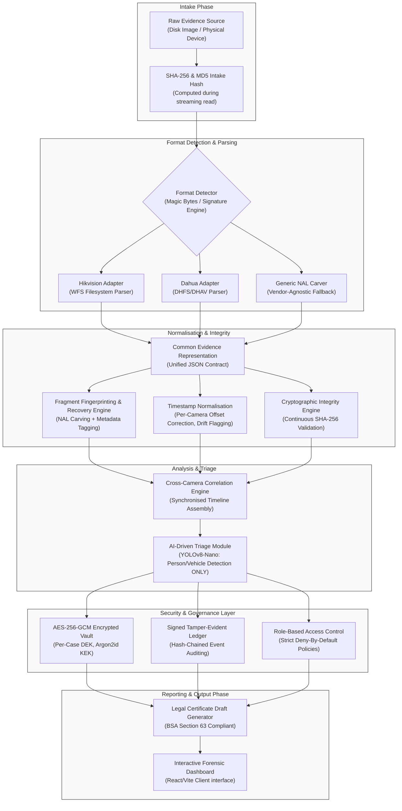

<div align="center">

# Phoenix

### Multi-Vendor DVR/NVR Forensic Analysis Tool

**SIH 2026 · Problem Statement SIH26150**
**National Technical Research Organisation (NTRO)**
**Theme: Blockchain & Cybersecurity**

*A court-defensible, vendor-agnostic forensic pipeline for surveillance footage recovery, integrity verification, and Indian legal compliance.*

</div>

---

## The Problem

DVR/NVR surveillance footage is often the most critical evidence in a criminal investigation — yet every major vendor (Hikvision, Dahua, CP Plus, Honeywell, TP-Link, Godrej, Uniview, Matrix) stores it in a **proprietary, undocumented format**. Investigators cannot extract footage, recover deleted segments, or verify evidence integrity without vendor-specific tools that are:

- Foreign, closed-source, and legally opaque
- Priced between \$2,000–\$10,000/year
- Impossible to cross-examine in a court of law

In *Chandrabhan Sudam Sanap v. State of Maharashtra* (2025 INSC 116), the Supreme Court refused to rely on CCTV footage in a death-sentence appeal because the prosecution never produced the mandatory **Section 65-B(4) certificate** — even correctly preserved evidence is worthless in court without proper procedural custody documentation. This is exactly the gap Phoenix is built to close.

---

## System Architecture



---

## Core Capabilities

| Capability | Description |
|---|---|
| Native Parsing | Deep, validated filesystem parsers for Hikvision (WFS) and Dahua (DHFS/DHAV) |
| Generic Recovery | NAL-unit carving fallback for every other vendor |
| Encrypted Evidence Vault | Per-case AES-256-GCM encryption with Argon2id-derived keys |
| Tamper-Evident Ledger | Signed, hash-chained audit ledger — every pipeline event permanently recorded |
| Legal Compliance | Auto-populated BSA Section 63 certificate draft; DPDP Act 2023 aligned |
| AI Triage | YOLOv8-nano object/person/vehicle detection for triage only, never identification |
| Timestamp Normalisation | Per-camera clock-offset correction, UTC/IST handling, drift flagging |
| Confidence-Scored Reporting | Every result is explicitly labelled by validation status |

---

## Vendor Support Matrix

| Vendor Format | Support Level | Notes |
| :--- | :--- | :--- |
| H.264 / H.265 (Generic) | **Fully Validated** | Robust stream carving, annex-B reassembly, and NAL unit extraction. |
| Dahua | **Partial** | Signature detection works. DHFS filesystem parsing is incomplete; the adapter currently falls back to signature-based carving (DHAV magic bytes) with hardcoded confidence. |
| Hikvision | **Stubbed** | Currently implemented as a stub interface. Detection relies on signature matching; extraction delegates to the Generic Carver. |
| CP Plus / Godrej / Uniview | **Generic fallback** | No sufficiently detailed public spec; handled via generic NAL carving. |
| Honeywell | **Research target** | Recent academic research exists; identified as next validation target. |
| Matrix / TP-Link | **Research target** | No sufficiently detailed public specification identified. |

> Every limitation is paired with its mitigation. A tool that reports exactly what it is confident about is more forensically credible than one that claims uniform support for everything.

---

## Security Layer

### Encryption
- **Important Demo Limitation:** Encryption keys live only in memory. A vault cannot be reopened after the process exits. This is acceptable for the demonstration but means data cannot be persistently decrypted across reboots.
- Per-case **envelope encryption**: one random 256-bit Data Encryption Key (DEK) per case
- DEK wrapped by a Key Encryption Key (KEK) derived via **Argon2id**
- Every artifact encrypted with **AES-256-GCM**, unique nonce per operation
- Evidence is **always hashed on plaintext before encryption** — the hash is the forensic identity of the evidence, independent of any key

### AI Triage (Stub / Not Connected)
- **What it does:** Runs YOLOv8-nano against keyframes to detect broad categories (people, vehicles) without attempting facial recognition.
- **State:** **Mock/Not Connected**. The YOLOv8 model is implemented (`backend/ai/triage.py`) but is not currently wired into the real pipeline (frame extraction -> YOLO -> DetectionResult -> API). Any UI implication or pitched capability of live detection boxes is currently a mock concept. This is a deliberate limitation before freeze.

### Audit Ledger

- Every pipeline event (intake, recovery, encryption, access, denial, export, report) written as a signed, hash-chained ledger entry
- Every access decision — granted or denied — is logged, not just data operations
- This is **not a blockchain** — a real distributed ledger requires multi-party consensus not achievable in a single-node deployment. This is a permissioned, tamper-evident, hash-chained ledger, named exactly for what it is.

### Role-Based Access Control

Four roles, deny-by-default: Investigator · Technical Expert · Auditor · Court/Export

### Live Tamper Verification

Modify a ledger entry — verification fails visibly. Attempt unauthorized decryption — denied and logged.

---

## Legal Compliance

- **BSA Section 63 (formerly IT Act 65-B) Certificate**
- **Note for Demo:** The certificate generator is currently a CLI-only tool (run via `agy` or `python -m backend.ledger.cert_generator` or similar). There is no UI button for this in the prototype.
- Auto-populates standard form fields mapping technical hashes to legal paragraphs.
- Produces a final PDF/Markdown draft for the examiner to sign.
- **DPDP Act 2023, Section 17(1)(c)** — covers processing of bystander data necessary for prevention, detection, investigation or prosecution of offences.
- **AI Policy** — YOLOv8-nano for object/person/vehicle detection triage only. Never used for identity claims or face-recognition matching.

---

## Repository Structure

```
/backend
  /core
    evidence_model.py         - Common Evidence Representation (JSON contract)
    interfaces.py             - Abstract base classes: BaseAdapter, Recovery, Ledger, Crypto
  /adapters
    /hikvision/               - Native WFS filesystem parser
    /dahua/                   - Native DHFS/DHAV parser
    /generic_carver/          - Vendor-agnostic NAL-unit carving fallback
  /crypto
    hashing.py                - Integrity hashing (SHA-256, plaintext-first)
    encryption.py             - AES-256-GCM envelope encryption
    key_manager.py            - Key generation, wrapping/unwrapping, rotation interface
  /ledger
    audit_ledger.py           - Signed hash-chained audit ledger
    rbac.py                   - Role-based access control
  /reporting
    certificate_draft.py      - Legal certificate-draft generator
  /api
    main.py                   - FastAPI routes (sole API surface for frontend)
/frontend
  /dashboard                  - Evidence intake, case status, recovery progress
  /video-viewer               - Recovered footage playback and comparison
  /timeline                   - Cross-camera correlation view
/hardware
  /acquisition_rig/           - Physical / simulated DVR acquisition setup
/docs
  architecture.md
/tests
  /fixtures/
```

> **Hard rule:** `evidence_model.py` and `interfaces.py` are locked once the first merge lands. Every other module is built against this contract — a late change breaks every downstream branch simultaneously.

---

## Novelty Statement

> "We are not the first to recover DVR footage — we are the first to combine validated recovery techniques with automated Indian legal certification, an encrypted evidence vault, and honest, confidence-scored multi-vendor reporting, in one court-defensible pipeline."

---

## Explicit Boundaries

| What Phoenix does | What Phoenix does not do |
|---|---|
| Fragment detection and recovery | Face identification |
| Object/person/vehicle triage (YOLOv8-nano) | Identity claims of any kind |
| BSA Section 63 certificate draft | Generate a legally binding certificate |
| Permissioned hash-chained ledger | Multi-node distributed blockchain |
| Evidence hash on plaintext | Personal data or video on any public chain |

---

## Definition of Done

Every feature is considered complete only when:

- [ ] Works end-to-end, not just in isolation
- [ ] Known input produces a known, verified output
- [ ] At least one failure or error case has been tested
- [ ] Output hash is recorded in the chain
- [ ] UI displays the result
- [ ] Ledger event is written for the action
- [ ] One line of documentation exists

---

<div align="center">

*Phoenix — SIH 2026 · NTRO · Blockchain & Cybersecurity*

</div>
