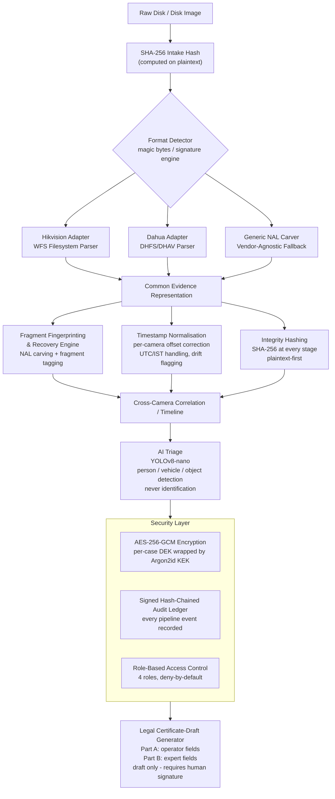

# Phoenix Architecture

For the canonical project overview, core capabilities, and vendor support matrix, please refer to the main [README.md](../README.md).

## Pipeline Flow

```mermaid
flowchart TD
    A[Raw Disk / Disk Image] --> B["SHA-256 Intake Hash\n(computed on plaintext)"]
    B --> C{Format Detector\nmagic bytes / signature engine}

    C --> D["Hikvision Adapter\nWFS Filesystem Parser"]
    C --> E["Dahua Adapter\nDHFS/DHAV Parser"]
    C --> F["Generic NAL Carver\nVendor-Agnostic Fallback"]

    D --> G[Common Evidence Representation]
    E --> G
    F --> G

    G --> H["Fragment Fingerprinting\n& Recovery Engine\nNAL carving + fragment tagging"]
    G --> I["Timestamp Normalisation\nper-camera offset correction\nUTC/IST handling, drift flagging"]
    G --> J["Integrity Hashing\nSHA-256 at every stage\nplaintext-first"]

    H --> K[Cross-Camera Correlation / Timeline]
    I --> K
    J --> K

    K --> L["AI Triage\nYOLOv8-nano\nperson / vehicle / object detection\nnever identification"]

    L --> M["Security Layer"]

    subgraph M["Security Layer"]
        M1["AES-256-GCM Encryption\nper-case DEK wrapped by Argon2id KEK"]
        M2["Signed Hash-Chained Audit Ledger\nevery pipeline event recorded"]
        M3["Role-Based Access Control\n4 roles, deny-by-default"]
    end

    M --> N["Legal Certificate-Draft Generator\nPart A: operator fields\nPart B: expert fields\ndraft only - requires human signature"]
```
