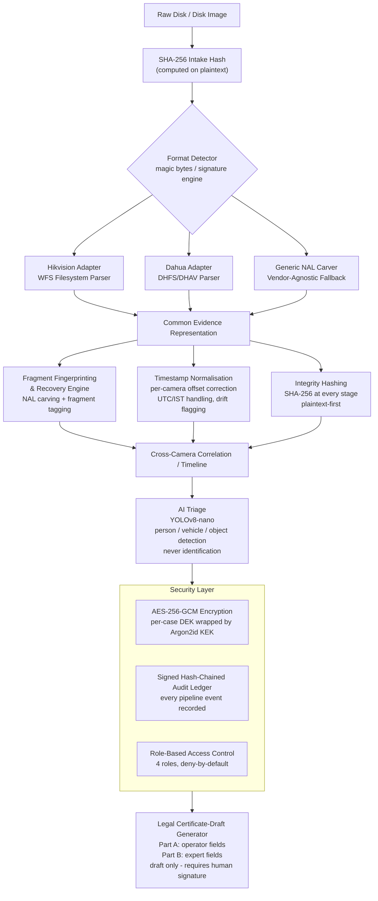

# Phoenix Architecture

For the canonical project overview, core capabilities, and vendor support matrix, please refer to the main [README.md](../README.md).

## Pipeline Flow

## Completed Items

- **Item 2 (custody-facts verification):** `docs/custody_facts_verification.md` — cross-check of `custody_facts.json` fields against BSA §63 Part A requirements; gaps and inconsistencies flagged; all required fields confirmed present. Branch: `feat/certificate-draft-generator`.
- **Item 1 (certificate-draft generator):** `backend/reporting/certificate_draft.py` — BSA §63 certificate-draft generator producing PDF (3-page A4, ReportLab) and HTML (Jinja2) from a single `CertificateDraft` data model, fed by `CustodyFacts`; prominent DRAFT banner in both formats; fails loudly on unverified images or missing required fields. Branch: `feat/certificate-draft-generator`.
- **Item 6 (frontend styling):** BLOCKED — `frontend/dashboard`, `frontend/timeline`, and `frontend/video-viewer` contain only `.gitkeep` on `main`; Shayanna's components do not yet exist. No work performed; no components fabricated. See final summary report.

## Case intake: local source path, not browser upload

Decided 6 Sep 2026. Evidence enters the pipeline as a **local source path** —
a disk image file or a raw device such as `\.\PhysicalDrive2` or `/dev/sdb` —
passed to `POST /acquisition/runs` as `source_path`. There is no upload
endpoint and none is planned.

This is a deliberate scope decision, not a missing feature:

* A real acquisition attaches the evidence disk through a hardware write
  blocker and images it locally. The examiner already has the device in front
  of them; a browser upload would add a copy step, not a capability.
* Multi-terabyte recorder disks are not something a browser upload can handle
  responsibly (partial uploads, temp storage, size limits), and every one of
  those failure modes would sit between the evidence and its hash.
* The acquisition itself is what establishes integrity: `acquire()` opens the
  source read-only, hashes SHA-256 and MD5 while streaming, and re-hashes the
  written image to verify it. An upload would happen *before* that boundary
  and could not be certified the same way.

If a future deployment needs remote intake, the honest shape is an agent
running on the examiner's own machine that images locally and ships the
already-hashed image, not a file picker in the dashboard.
