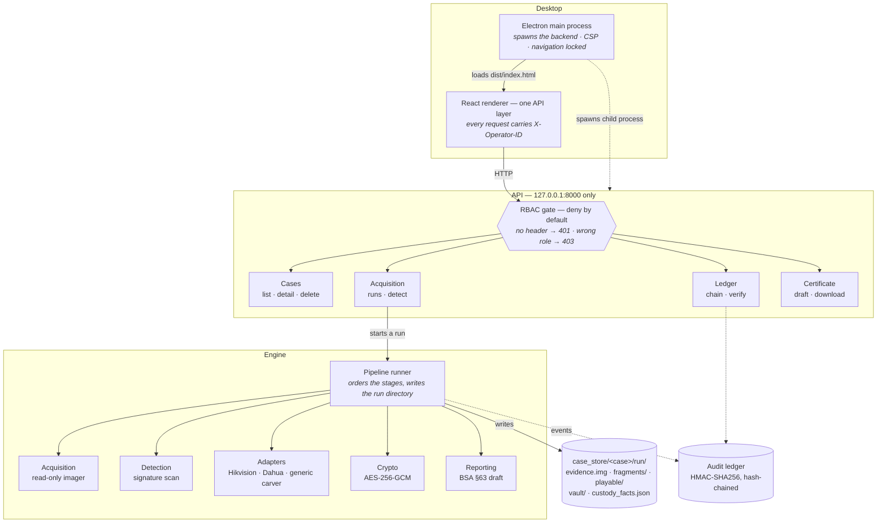
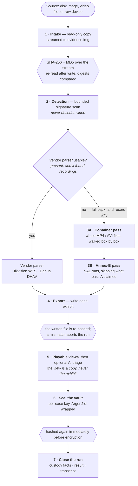

# Architecture and pipeline diagrams

Both diagrams render on GitHub. The same pair, laid out for presentation, is at
[docs/MANUAL_TESTING.md](MANUAL_TESTING.md) for the operating instructions.

## System architecture

Everything runs on the examiner's machine. The backend binds the loopback
interface only, and the desktop shell starts it as a child process it also kills
on exit, so there is no moment when evidence is reachable from the network.

The gate is the only way in. A permission is bound to a route when the route is
registered, never read from the request, so a manipulated query string cannot
widen what a caller may do. The run directory, not any in-memory table, is what
survives a restart.

## Pipeline flow

Plaintext is hashed before it is written and again before it is encrypted, so the
digest in the certificate always names bytes that existed on the disk. Where the
tool cannot be certain, it falls back rather than stopping.

A copied `.mp4` keeps its NAL units length-prefixed inside `mdat` and carries no
Annex-B start codes, so pass 3A is the only way such a file comes back whole. Pass
3B then scans everything pass 3A did not claim, which is what a recorder writes to
its own disk.

The hash points are the integrity chain: intake, post-write verification, export
re-hash, pre-encryption. Break any one of those links and the digest in the
certificate stops naming bytes anyone can check.

## Role permissions

Bound at route registration, enforced on every request.

| Role | Permissions | Can |
|---|---|---|
| `INVESTIGATOR` | `VIEW_EVIDENCE`, `RUN_CARVING`, `ANALYZE_TIMELINE` | create and delete cases, start acquisition, run detection |
| `TECHNICAL_EXPERT` | `VALIDATE_PARSER`, `GENERATE_CERT_DRAFT`, `EXPORT_REPORT` | run detection, generate the certificate draft |
| `AUDITOR` | `READ_LEDGER`, `VERIFY_INTEGRITY`, `AUDIT_LOGS` | verify the chain, run the tamper demonstration |
| `COURT_EXPORT` | `EXPORT_BUNDLE`, `VIEW_CERTIFICATE` | read the case, download the certificate |
