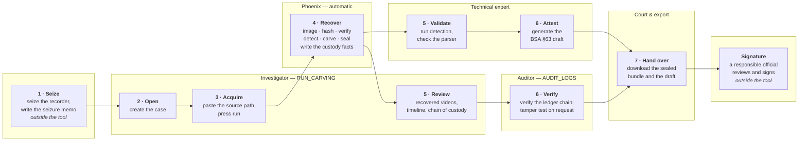

# Operating workflow and references

The architecture and pipeline diagrams are in
[architecture_diagrams.md](architecture_diagrams.md); the commands are in
[MANUAL_TESTING.md](MANUAL_TESTING.md). This file covers who does what, and what
the implementation was written against.

## Operating workflow

The lanes are the four roles the tool enforces. A step drawn in one lane is
refused to the others, so this is also the permission matrix.

Only two steps sit outside the tool, and both are deliberate: the seizure, which
is a physical act, and the signature, which a tool cannot supply for itself. The
auditor's verification is a separate role precisely so that the person who ran
the recovery is not the person who attests to it.

### Step by step

| # | Step | Role | What it produces |
|---|---|---|---|
| 1 | Seize and document the recorder | Investigator, outside the tool | seizure memo, device photographs |
| 2 | Create the case | Investigator | `case_store/<case>/case_meta.json` |
| 3 | Start the acquisition | Investigator | a job id; the run begins |
| 4 | Image, hash, verify, detect, carve, seal | Phoenix, automatic | the whole run directory |
| 5 | Review the exhibits; validate the parser | Investigator / Technical expert | nothing written; the record is read |
| 6 | Generate the draft; verify the chain | Technical expert / Auditor | `certificate/certificate_draft.pdf`, a chain verdict |
| 7 | Download the bundle | Court and export | the sealed artefacts and the unsigned draft |
| — | Review and sign | a responsible official, outside the tool | the signed certificate |

## References

What each part of the implementation was written against. Where no published
specification exists, that is said rather than glossed over.

### Legal basis

| Reference | Used for |
|---|---|
| **Bharatiya Sakshya Adhiniyam, 2023 — Section 63** (electronic records; in force 1 July 2024, replacing Section 65B of the Indian Evidence Act, 1872) | The certificate draft's structure, the separation of operator, investigator and custodian, and the rule that the signature block is left blank for a responsible official. |
| **Information Technology Act, 2000 — Section 79A** (examiner of electronic evidence) | Why limitations are reported verbatim: the examiner is accountable for the opinion, so the tool must not hide what it could not establish. |

### Forensic practice

| Reference | Used for |
|---|---|
| **ISO/IEC 27037:2012** — identification, collection, acquisition and preservation of digital evidence | Read-only acquisition, hashing at intake, verification of the copy against the source. |
| **ISO/IEC 27042:2015** — analysis and interpretation of digital evidence | Reporting confidence as reconstruction completeness with a rationale, never as a claim about content. |
| **NIST SP 800-86** — integrating forensic techniques into incident response | The stage order (acquire, examine, analyse, report) and hashing before each transformation. |
| **NIST CFTT** — disk imaging tool requirements | Post-write verification; refusing to overwrite an existing evidence file. |
| **SWGDE** — best practices for computer forensic acquisitions | Recording the tool version, platform and operator with every acquisition. |
| S. Garfinkel, **"Carving contiguous and fragmented files with fast object validation"**, DFRWS 2007 | The principle the container pass rests on: validate a carved object against its own format before claiming it. |

### Formats parsed

| Reference | Used for |
|---|---|
| **ITU-T H.264** / ISO/IEC 14496-10 — Advanced Video Coding | Annex B byte stream, NAL unit header, SPS and PPS syntax, and the emulation prevention bytes removed before parsing. |
| **ITU-T H.265** / ISO/IEC 23008-2 — High Efficiency Video Coding | Two-byte NAL header, VPS/SPS/PPS, sub-layer and conformance-window fields. |
| **ISO/IEC 14496-12** — ISO base media file format | The box structure the container pass walks: all three size forms, `ftyp`, `moov`, `mdat`, and `mvhd`/`tkhd`/`stsd` for duration and geometry. |
| **ISO/IEC 14496-15** — NAL unit structured video in ISOBMFF | The `avcC` and `hvcC` configuration records the lossless MP4 wrapper writes. |
| **Microsoft AVI RIFF file reference** | The RIFF header, and the `movi` list a real AVI must carry before it is claimed. |
| **ISO/IEC 13818-1** — MPEG-2 systems | The 188-byte packet and `0x47` sync byte the detector looks for. |

### Cryptography

| Reference | Used for |
|---|---|
| **FIPS 180-4** — SHA-256 | Every evidence digest: intake, verification, export, pre-encryption. |
| **RFC 1321** — MD5 | Recorded beside SHA-256 at intake only, so a digest can be cross-checked against older tools. Not relied on for integrity. |
| **FIPS 197** — AES | The evidence vault cipher. |
| **NIST SP 800-38D** — Galois/Counter Mode | Authenticated encryption, so a modified ciphertext fails to decrypt rather than decrypting to garbage. |
| **RFC 9106** — Argon2 | Argon2id derivation of the key-encryption key that wraps each case key. |
| **FIPS 198-1** / RFC 2104 — HMAC | Signing each audit ledger entry, which is what makes a tampered block detectable. |

### Vendor layouts have no published specification

Hikvision's WFS and Dahua's DHAV are proprietary and undocumented. Everything
this project does with them comes from observed structure, the fixtures that
exercise them are synthetic, and each signature carries a flag recording that it
is not confirmed against a real device (`verified_on_device`). Where a vendor
parser cannot establish a volume's layout, the run falls back to the generic
carver and records that it did — which is the whole reason the fallback exists.
